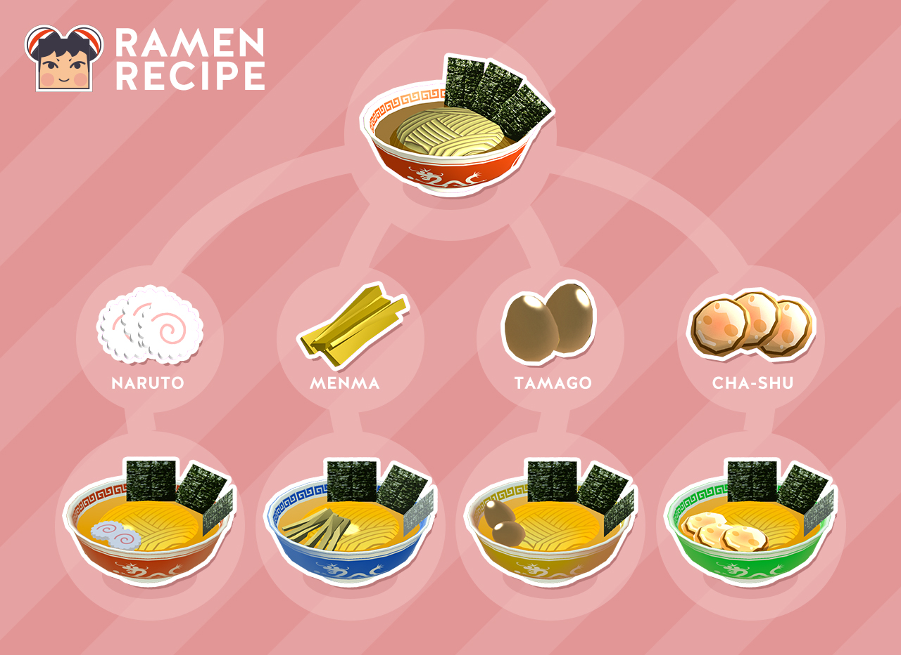

+++
date = 2016-08-26T19:53:45+09:00
draft = false
tags = ["logo", "3D", "ui", "movie", "planning"]
title = "Counter Fight"
share = false
image = "/develop/cf/images/cover.jpg"
description = "VR Game for PC & PSVR"
categories = ["develop"]
information = "true"
developmentPeriod = "1.5ヶ月"
member = "開発者1名 / デザイナー1名"
detail = ["2作目のVRゲームです。2016年段階で実現可能なVR体験は現在よりも幅が狭く、VR酔いの懸念もあったため、その場を動かない仕様で、全体的な設計も非常にカジュアルなものに決定しました。","コンセプト段階ではラーメン屋で湯切りをするだけのゲームでしたが、技術者と開発を進める中でよりゲーム性を高めるため、「時間内に注文された料理を作るゲーム」に変更しました。","物を投げてお客さんにぶつけられる等、VRならではの面白さも追加しています。","結果、非常に大きな反響をいただき、この後に続く開発やアイデア出しの基礎になっています。"]

[[workDetail]]
  title = "キャラクター"
  [workDetail._target]
    text = "デザインからモデリング・テクスチャ制作、Humanoidセットアップ"
[[workDetail]]
  title = "背景・小道具"
  [workDetail._target]
    text = "モデリング後Unity上でシーンビルド、Prefab化"
[[workDetail]]
  title = "UI"
  [workDetail._target]
    text = "デザイン、Unity上でのレイアウトまでを担当"
[[workDetail]]
  title = "その他ゲーム内作業"
  [workDetail._target]
    text = "企画・提案、キャラクターアニメーション、エフェクト"
[[workDetail]]
  title = "ゲーム外制作物"
  [workDetail._target]
    text = "ロゴ、ストア画像アセット、プロモーション動画"

+++

### artwork / logo / character design

Cinema 4D, Modo, Adobe CC

制作期間 : 1ヶ月

### Scene Design

Unity, Cinema 4d, Adobe CC, Substance Painter



### PV

Adobe CC, Cinema 4d



制作期間 : 2週間

### LINE stamp

Adobe CC

制作期間 : 1週間
