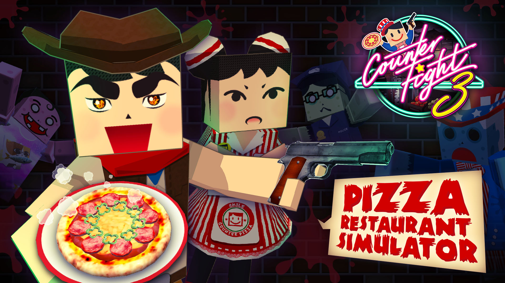
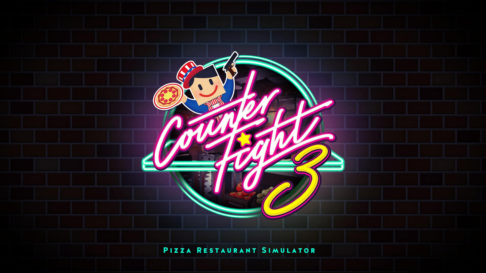

+++
date = 2018-12-20T20:34:13+09:00
draft = false
tags = ["logo", "3D", "ui", "movie", "planning"]
title = "Counter Fight 3"
share = false
image = "/develop/cf3/images/cover.jpg"
description = "VR Game for PC & PSVR"
categories = ["develop"]
information = "true"
developmentPeriod = "3ヶ月"
member = "開発者2名 / デザイナー2名"
detail = ["デザイナー1名に作業を教えつつ開発を進めたタイトルで、ツールの基本操作や実装前のデータづくりの方法を伝達し、自分は主要なモデリングや細かい部分の制作フォロー(UIや販促画像など)を担当しています。","最終的に若干のバランス調整を施し、PlayStation VRでも配信中です。"]

[[workDetail]]
  title = "ディレクション"
  [workDetail._target]
    text = "クオリティ管理、ツール使用方法のレクチャー、制作物の要件定義"
[[workDetail]]
  title = "UI"
  [workDetail._target]
    text = "デザイン後、Unity上でレイアウト"
[[workDetail]]
  title = "その他ゲーム内作業"
  [workDetail._target]
    text = "企画・提案、キャラクターアニメーション、エフェクト、簡易C#スクリプト、ゲーム内テキスト(日本語、英語)"
[[workDetail]]
  title = "ゲーム外制作物"
  [workDetail._target]
    text = "ロゴ、ストア画像アセット、プロモーション動画"

+++

### artwork / character design

Modo, Adobe CC

制作期間 : 3週間

### logo

Adobe CC

制作期間 : 1週間

### level design

Unity, Adobe CC, Substance Painter



制作期間 : 3ヶ月

### PV

Adobe CC, Unity



制作期間 : 2週間
