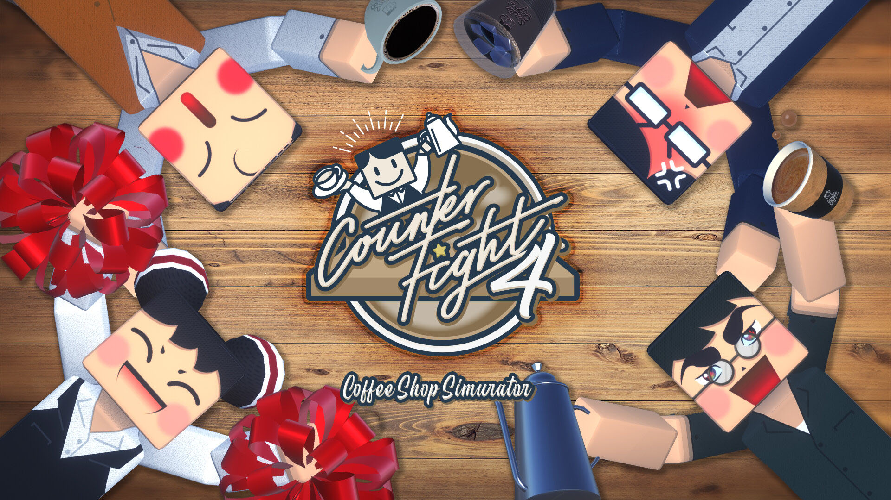

+++
date = 2020-02-20T20:34:13+09:00
draft = false
tags = ["logo", "3D", "ui", "movie", "planning"]
title = "Counter Fight 4"
share = false
image = "/develop/cf4/images/cover.jpg"
description = "VR Game for PC"
categories = ["develop"]
information = "true"
developmentPeriod = "3ヶ月"
member = "開発者1名 / デザイナー1名"
detail = ["この作品から以前より現代風な絵作りへ近づけるためシェーダーを全てPBRへ切り替え、レンダーパイプラインもUnity URPに移行しています。","新たにお客さんがやってくる枠の増加やフィーバーシステムの導入など、新しいシステムを企画・実装しています。","開発期間中はVRコンテンツの市場が短時間で楽しむものから、比較的長い時間遊べるコンテンツを求める段階へ変化しつつある時期だったこともあり、ゲームバランスは前作よりライトな方向性へ調整し、長時間プレイできるような仕様へと変更しています。","韓国のSmilegate社、STOVE VRでのサービスを契約しています。"]

[[workDetail]]
  title = "キャラクター"
  [workDetail._target]
    text = "既存キャラクターのポリゴン数を増やしたり、表情を微妙に刷新しブラッシュアップ"
[[workDetail]]
  title = "背景・小道具"
  [workDetail._target]
    text = "デザインからモデリング・テクスチャ制作、Unity上でシーンビルド、Prefab化"
[[workDetail]]
  title = "UI"
  [workDetail._target]
    text = "デザイン後、Unity上でレイアウトまで担当"
[[workDetail]]
  title = "その他ゲーム内作業"
  [workDetail._target]
    text = "企画・提案、キャラクターアニメーション、エフェクト、簡易C#スクリプト、ゲーム内テキスト"
[[workDetail]]
  title = "ゲーム外制作物"
  [workDetail._target]
    text = "ロゴ、ストア画像アセット、プロモーション動画"

+++

### artwork / logo / character design

Modo, Adobe CC

制作期間 : 2週間

### level design

Unity, Adobe CC, Substance Painter



制作期間 : 1ヶ月

### PV

Adobe CC, Unity



制作期間 : 2週間
