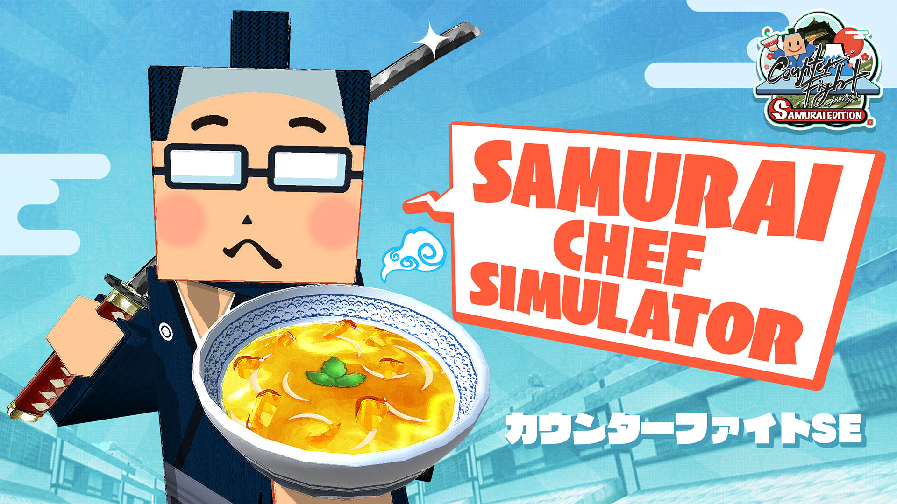
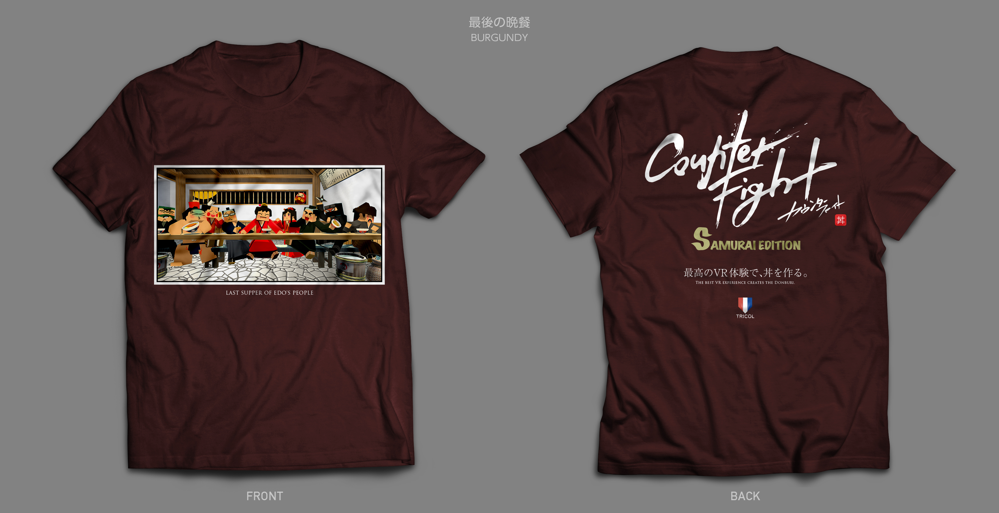

+++
date = 2016-10-26T20:34:13+09:00
draft = false
tags = ["logo", "3D", "ui", "movie", "planning"]
title = "Counter Fight SE"
share = false
image = "/develop/cfse/images/cover.jpg"
description = "VR Game for PC & PSVR"
categories = ["develop"]
information = "true"
developmentPeriod = "1.5ヶ月"
member = "開発者1名 / デザイナー1名"
detail = ["カウンターファイトの好評を受け開発した第2弾の作品になります。技術者と共同で前作よりもゲームバランスをブラッシュUPさせ、前回以上に快適なプレイ感覚を提供するため、テストプレイは多めに時間を割いています。","刀でも食材が切れる、お客さんがカウンター攻撃を仕掛けてくる、時間の流れが遅くなった世界で動けるようにしたいなど、自分の提案も多数採用されています。"]

[[workDetail]]
  title = "キャラクター"
  [workDetail._target]
    text = "既存アセットの簡易的な修正のみ"
[[workDetail]]
  title = "背景・小道具"
  [workDetail._target]
    text = "デザインからモデリング・テクスチャ制作、Unity上でのシーンビルド、Prefab化"
[[workDetail]]
  title = "UI"
  [workDetail._target]
    text = "デザイン後、Unity上でレイアウトまで担当"
[[workDetail]]
  title = "その他ゲーム内作業"
  [workDetail._target]
    text = "企画・提案、キャラクターアニメーション、エフェクト、ゲーム内テキスト(日本語、英語)"
[[workDetail]]
  title = "ゲーム外制作物"
  [workDetail._target]
    text = "ロゴ、ストア画像アセット、プロモーション動画"

+++

### artwork / logo / character design

Cinema 4D, Modo, Adobe CC

制作期間 : 2週間

### level design

Unity, Cinema 4d, Adobe CC, Substance Painter



制作期間 : 1ヶ月

### PV

Adobe CC, Cinema 4d



制作期間 : 2週間

### T-Shirts

Adobe CC

