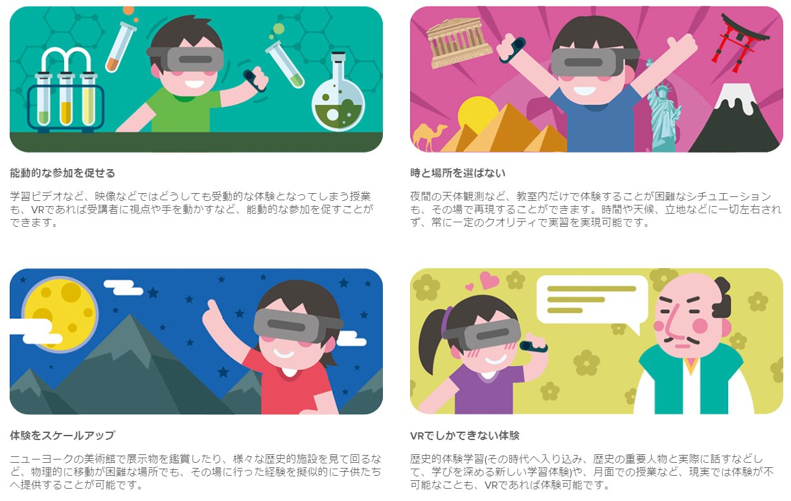
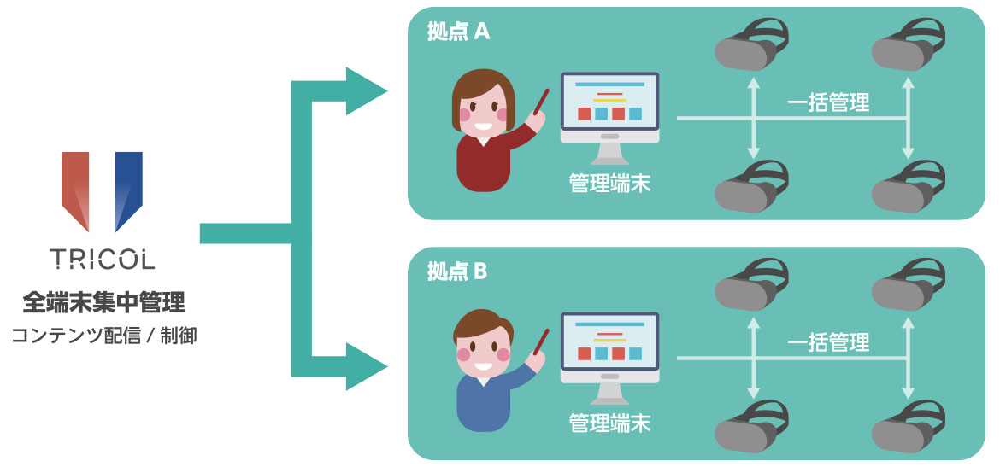

+++
date = "2018-05-15T16:20:52+09:00"
draft = false
tags = ["logo", "3D", "ui", "movie"]
title = "Edcol"
share = false
image = "/develop/edcol/images/cover.jpg"
description = "VR education app"
categories = ["develop"]
information = "true"
developmentPeriod = "2ヶ月"
member = "開発者1名 / デザイナー1名"
detail = ["教育ITソリューションEXPOに出展した、教育コンテンツのデモ版です。","季節に応じた月の満ち欠けの様子を仮想空間で一気に観察したり、地球と同じサイズになって月や太陽との位置関係を把握することができます。","地層の観察コンテンツでは、場所に応じて異なる化石や物質を採掘できるようにし、実際の現場のような状況を再現できるよう設計を行いました。","その他にも、地層の成り立ちにおける堆積する土砂の様子を3D模型で分かりやすく解説したり、花の受粉の様子や、生きた様子を見るのが現実では難しい生物のモデルを外観から体の内部まで自由に観察できる機能などを企画しました。"]

[[workDetail]]
  title = "背景・小道具"
  [workDetail._target]
    text = "モデリング後Unity上でシーンビルド、Prefab化、配置"
[[workDetail]]
  title = "UI"
  [workDetail._target]
    text = "デザイン、Unity上でのレイアウトまでを担当"
[[workDetail]]
  title = "その他ゲーム内作業"
  [workDetail._target]
    text = "企画・提案、エフェクト、アニメーション、全体軽量化作業"
[[workDetail]]
  title = "ゲーム外制作物"
  [workDetail._target]
    text = "ロゴ、販促画像のデザイン、プロモーション動画"

+++

### PV

After Effects, Unity, Modo



制作期間 : 1週間

### feature

Illustrator

### scene design

Modo, Unity, Substance Painter



制作期間 : 1ヶ月
