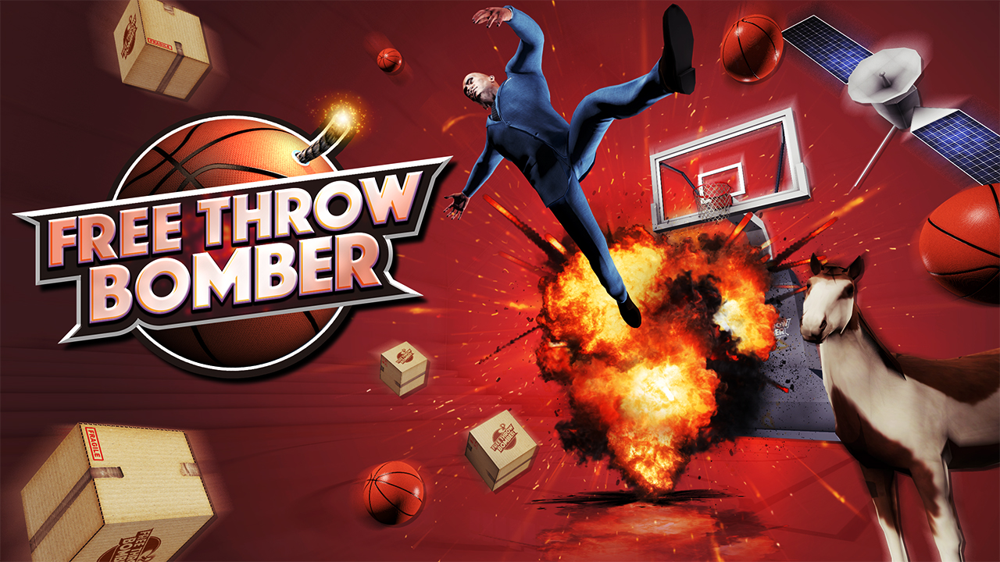
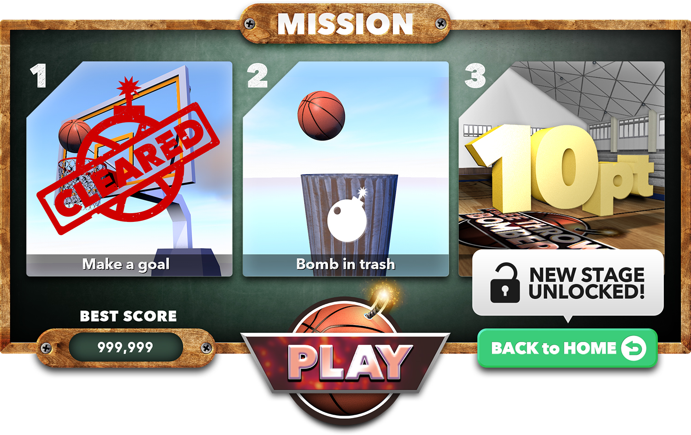

+++
date = "2016-02-21T16:20:52+09:00"
draft = false
tags = ["logo", "3D", "ui", "movie"]
title = "Free throw bomber"
share = false
image = "/develop/ftb/images/cover.jpg"
description = "VR Game for Mobile"
categories = ["develop"]
information = "true"
developmentPeriod = "1ヶ月"
member = "開発者1名 / デザイナー1名"
detail = ["Gear VR用に開発した最初のミニゲームです。Unityやモデリングの方法を試行錯誤しながら制作したものですが、本タイトルをきっかけに日本のFacebook社Oculusのアジアメンバーの方々や、様々な方と知り合う結果となった作品です。"]

[[workDetail]]
  title = "背景・小道具"
  [workDetail._target]
    text = "バスケットゴールと周囲の建物をモデリング、Unity上でシーンビルド、Prefab化"
[[workDetail]]
  title = "UI"
  [workDetail._target]
    text = "デザイン後、Unity上でレイアウトまで担当"
[[workDetail]]
  title = "その他ゲーム内作業"
  [workDetail._target]
    text = "企画・提案、エフェクト、全体軽量化作業、ゲーム内テキスト(日本語、英語)"
[[workDetail]]
  title = "ゲーム外制作物"
  [workDetail._target]
    text = "ロゴ、ストア画像アセット、プロモーション動画"

+++

### artwork / logo

Cinema 4D, Photoshop, Illustrator

制作期間 : 1週間

制作期間 : 1週間

### level design

Cinema 4d, Unity, Photoshop



制作期間 : 1ヶ月

### PV

After Effects, Cinema 4d



制作期間 : 1週間

### UI

Cinema 4D, Photoshop, Illustrator

