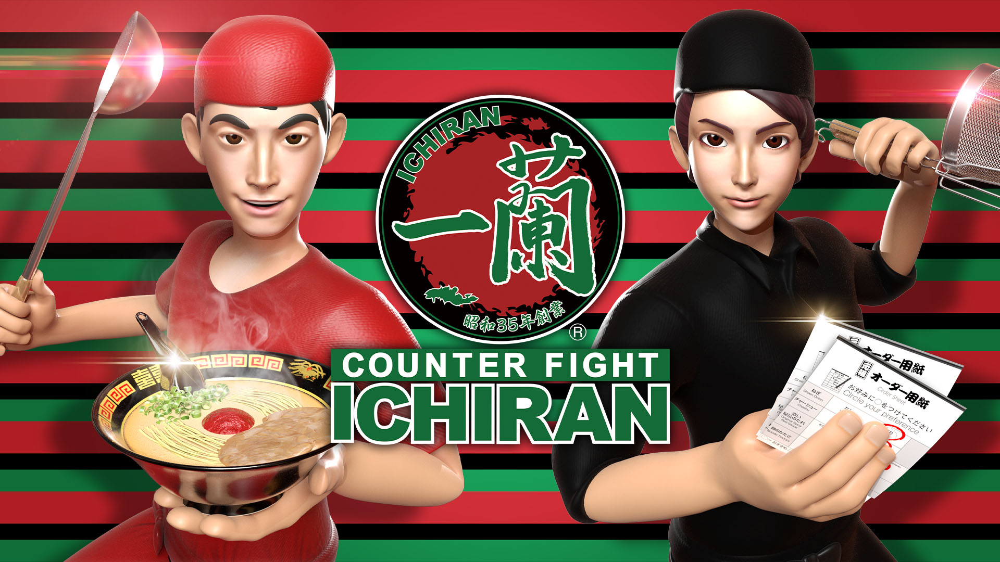
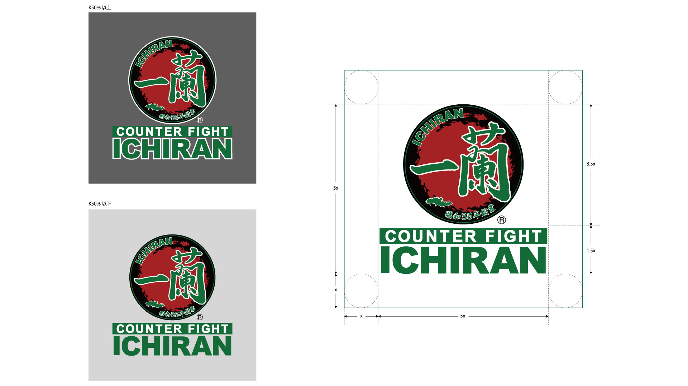

+++
date = 2021-01-15T20:34:13+09:00
draft = false
tags = ["logo", "3D", "ui", "movie", "planning"]
title = "Counter Fight ICHIRAN"
share = false
image = "/develop/ichiran/images/ichiran_cover.jpg"
description = "Game for Oculus Quest / Quest2"
categories = ["develop"]
information = "true"
developmentPeriod = "6ヶ月"
member = "開発者1名 / デザイナー1名"
detail = ["一蘭とカウンターファイトのコラボレーション企画として約半年間で開発。Questでのリリース審査はゲームプレイ中のフレームレートを72fpsに遵守することが原則で、加えてデバッグも非常に厳格でした。","シェーダー修正や全メッシュの見直し、UIの再設計など、結果的に開発期間の多くをそれらの修正に費やすこととなりましたが、最終的に全てのバグチケットを消化し、無事にリリース完了しました。","基本的にVRコンテンツ開発では背景オブジェクトをひとつのメッシュに統合しドローコール削減を狙ってきましたが、本作ではBatchesよりも1フレーム毎の軽量化が不可欠なため、Occlusion cullingによって負荷を軽減しています。","基本的にデザイナー1名でゲーム内、ゲーム外の制作業務は全行程を担当しています。"]

[[workDetail]]
  title = "キャラクター"
  [workDetail._target]
    text = "デザインからモデリング・テクスチャ制作、LOD生成、Humanoidセットアップ"
[[workDetail]]
  title = "背景・小道具"
  [workDetail._target]
    text = "モデリング(背景は実際の店舗で計測)後Unity上でシーンビルド、Prefab化"
[[workDetail]]
  title = "UI"
  [workDetail._target]
    text = "デザイン後、Unity上でレイアウトまで担当"
[[workDetail]]
  title = "その他ゲーム内作業"
  [workDetail._target]
    text = "企画・提案、キャラクターアニメーション、エフェクト、シェーダー修正、簡易C#スクリプト、全体軽量化作業、ゲーム内テキスト(日本語、英語、中国語)"
[[workDetail]]
  title = "ゲーム外制作物"
  [workDetail._target]
    text = "ロゴ、ストア画像アセット、プロモーション動画、販促ポスター、Twitter広告動画"

+++

### artwork / character design

Modo, Adobe CC



制作期間 : 1週間

### level design

Unity, Adobe CC, Substance Painter



制作期間 : 4ヶ月

### PV

Adobe CC, Unity



制作期間 : 1週間

### logo

Modo, Adobe CC

制作期間 : 1週間

### poster & card

Adobe CC



制作期間 : 1週間
