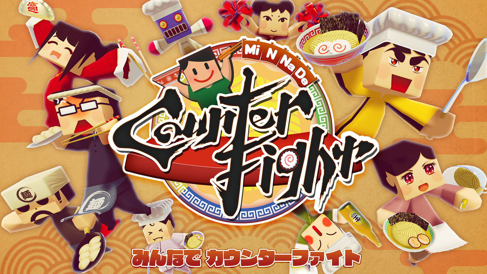
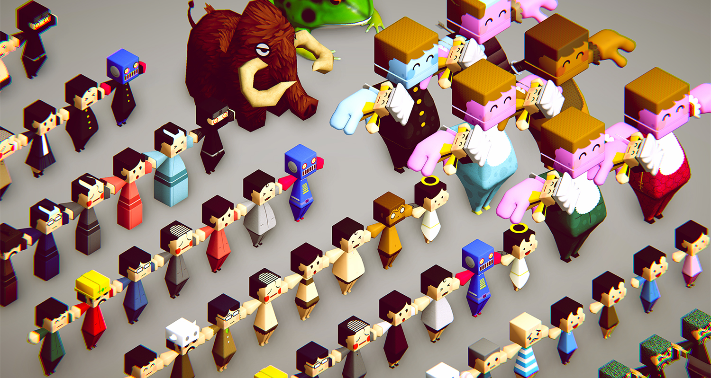
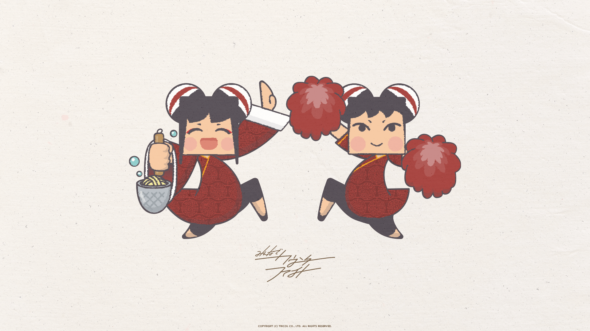
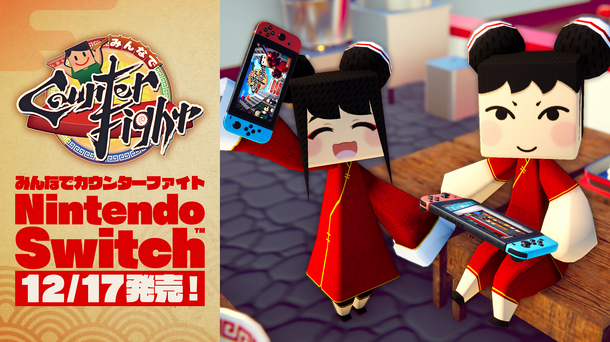

+++
date = 2020-05-02T20:34:13+09:00
draft = false
tags = ["logo", "3D", "ui", "movie", "planning"]
title = "MiNNaDe Counter Fight"
share = false
image = "/develop/mcf/images/cover.jpg"
description = "Game for PC & Nintendo Switch"
categories = ["develop"]
information = "true"
developmentPeriod = "6ヶ月"
member = "開発者1名 / デザイナー1名"
detail = ["４人協力プレイが可能な、マルチプレイクッキングゲームです。","初のVR以外の自社コンテンツとして開発しました。","コンテンツボリュームの出し方や販売方法、中規模ゲームを開発するためのポイントをノウハウとして身に着けることができ、また同時にVRと通常のPCゲームとの違いなども把握することができたタイトルです。","デザインによってキャラクターステータスが変化する、オリジナルキャラクターデザインシステムなども企画・実装しました。","2020年末よりNintendo Switchより配信中です。"]

[[workDetail]]
  title = "キャラクター"
  [workDetail._target]
    text = "デザインからモデリング・テクスチャ制作、Humanoidセットアップ"
[[workDetail]]
  title = "背景・小道具"
  [workDetail._target]
    text = "デザインからモデリング・テクスチャ制作、Unity上でのシーンビルド、グリッドシステム上に各オブジェクトを配置できる状態にPrefab化(一部は購入アセットを最適化して実装)"
[[workDetail]]
  title = "UI"
  [workDetail._target]
    text = "デザイン、Unity上でのレイアウトまでを担当"
[[workDetail]]
  title = "その他ゲーム内作業"
  [workDetail._target]
    text = "企画・提案、キャラクターアニメーション、エフェクト、シェーダー修正、簡易C#スクリプト、ゲーム内テキスト(日本語、英語、中国語・簡体字/繫体字)"
[[workDetail]]
  title = "ゲーム外制作物"
  [workDetail._target]
    text = "ロゴ、ストア画像アセット、プロモーション動画"

+++

### artwork / character design

Modo, Adobe CC

制作期間 : 2ヶ月

### UI

Adobe CC, Unity



制作期間 : 1ヶ月

### Scene Design

Unity, Adobe CC, Substance Painter



制作期間 : 3ヶ月

### logo

Adobe CC



制作期間 : 1週間

### PV

Adobe CC, Unity



制作期間 : 1週間

### wallpaper

Adobe CC

### sns image

Adobe CC




### Avatar Skin

Adobe CC

