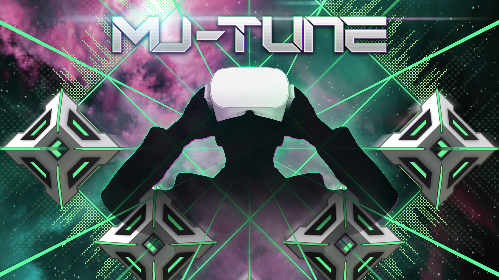

+++
date = 2018-07-26T20:34:13+09:00
draft = false
tags = ["logo", "3D", "ui", "movie", "planning"]
title = "Mu-tune"
share = false
image = "/develop/mt/images/cover.jpg"
description = "VR Game for Mobile & Oculus Go"
categories = ["develop"]
information = "true"
developmentPeriod = "1.5ヶ月"
member = "開発者1名 / デザイナー1名"
detail = ["Android端末とOculus Go用に開発したリズムゲームです。、Youtubeから動画を引用し、譜面を自動生成する機能（特許出願中 特願2018-175664号）を持っています。","限られた開発期間の中で「音ゲーとしての気持ち良さ」の調整に多くの時間をとるため、画面内のほとんどの要素を画像(skybox)で構成し、エフェクトや操作感の調整を重点的におこないました。"]

[[workDetail]]
  title = "背景・小道具"
  [workDetail._target]
    text = "デザインからモデリング・テクスチャ制作、Prefab化、Unityシーンビルド"
[[workDetail]]
  title = "UI"
  [workDetail._target]
    text = "デザイン、Unity上でのレイアウトまでを担当"
[[workDetail]]
  title = "その他ゲーム内作業"
  [workDetail._target]
    text = "企画・提案、エフェクト、シェーダー修正、簡易C#スクリプト、ゲーム内テキスト"
[[workDetail]]
  title = "ゲーム外制作物"
  [workDetail._target]
    text = "ロゴ、ストア画像アセット、プロモーション動画"

+++

### artwork / logo

Modo, Adobe CC

### Scene Design

Unity, Adobe CC, Modo, Substance Painter



### PV

Adobe CC, Modo


