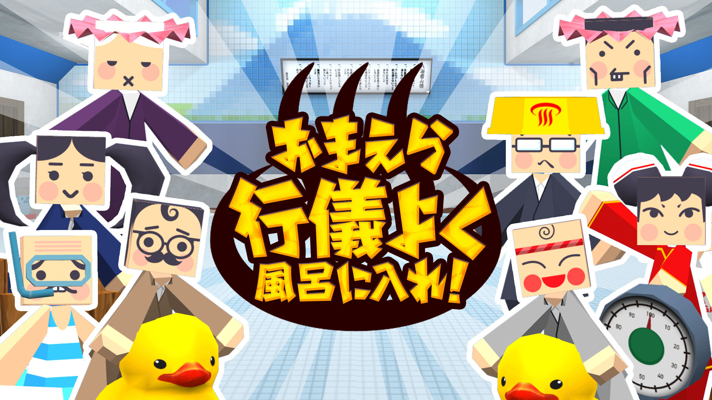

+++
date = 2018-07-09T20:34:13+09:00
draft = false
tags = ["logo", "3D", "ui", "movie", "planning"]
title = "OmaFuro!"
share = false
image = "/develop/omafuro/images/cover.jpg"
description = "VR Game for Mobile & Oculus Go"
categories = ["develop"]
information = "true"
developmentPeriod = "1.5ヶ月"
member = "開発者1名 / デザイナー1名"
detail = ["Android端末用に開発したハイパーカジュアルVRシューティングゲームです。","プレイヤーは銭湯の管理人となって、4つのステージでお風呂をディフェンスしなければなりません。","多種多様な敵キャラが出現するため、キャラクター8体＋小道具のテクスチャを全て1枚の画像に集約することで軽量化し、UV座標のスライドのみで全キャラクター及びオブジェクトを表現できるように設計し、ドローコールを削減しています。"]

[[workDetail]]
  title = "キャラクター"
  [workDetail._target]
    text = "デザインからモデリング・テクスチャ制作、Humanoidセットアップ(リギングはせず、腕や顔など各パーツを切り分け、ボーンに連結することで軽量化)"
[[workDetail]]
  title = "背景・小道具"
  [workDetail._target]
    text = "モデリング後Unity上でシーンビルド、Prefab化、配置"
[[workDetail]]
  title = "UI"
  [workDetail._target]
    text = "デザイン、Unity上でのレイアウトまでを担当"
[[workDetail]]
  title = "その他ゲーム内作業"
  [workDetail._target]
    text = "企画・提案、エフェクト、キャラクターアニメーション、全体軽量化作業"
[[workDetail]]
  title = "ゲーム外制作物"
  [workDetail._target]
    text = "ロゴ、アイコン、ストア画像アセット"

+++

### artwork / logo

Modo, Adobe CC

制作期間 : 1日

### Scene Design

Unity, Adobe CC, Modo, Substance Painter





制作期間 : 1ヶ月

### icon

Adobe CC

制作期間 : 1日
