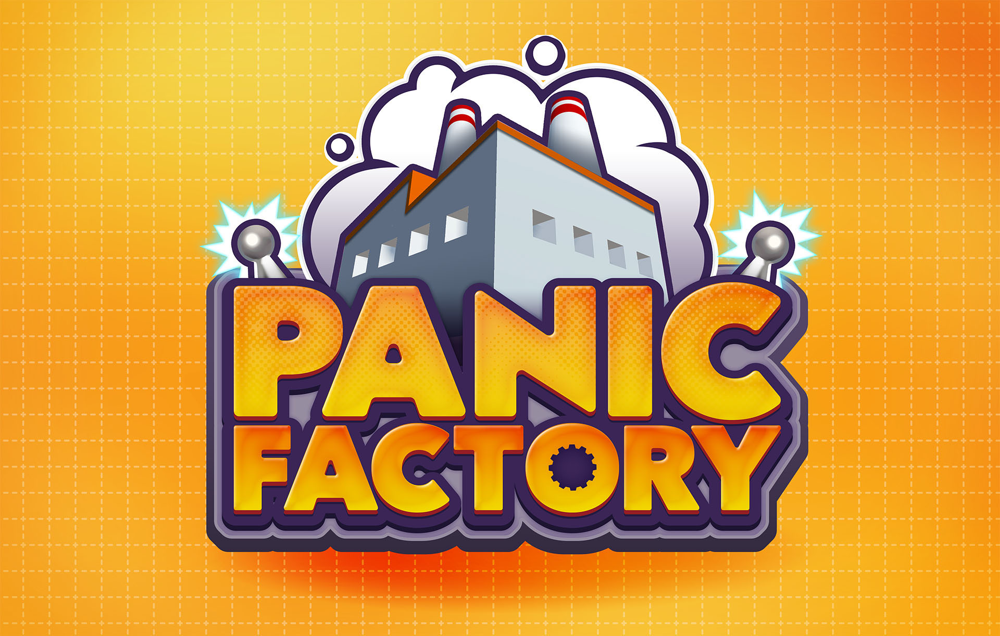
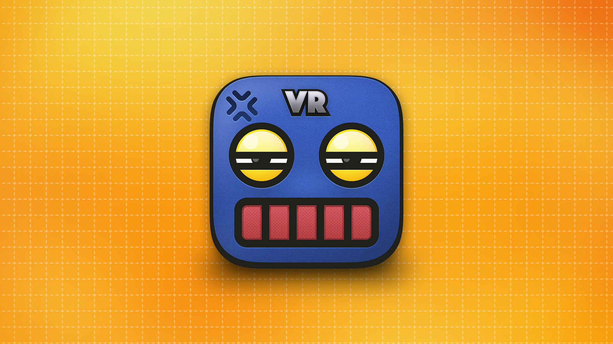

+++
date = "2018-05-21T16:20:52+09:00"
draft = false
tags = ["logo", "3D", "ui", "movie", "planning"]
title = "Panic Factory"
share = false
image = "/develop/pf/images/cover.jpg"
description = "VR Game for Mobile"
categories = ["develop"]
information = "true"
developmentPeriod = "1.5ヶ月"
member = "開発者1名 / デザイナー1名"
detail = ["Android端末用に開発したハイパーカジュアルVRゲームです。プレイヤーは工場の従業員となり、限られた時間内に指示通りの商品をできるだけ多く組み立てなければなりません。","モバイル向けの軽量化処理を多数実装しており、2015年以降のAndroid端末であればプレイ可能です。"]

[[workDetail]]
  title = "キャラクター"
  [workDetail._target]
    text = "デザインからモデリング・テクスチャ制作、Humanoidセットアップ"
[[workDetail]]
  title = "背景・小道具"
  [workDetail._target]
    text = "モデリング後Unity上でシーンビルド、Prefab化、配置"
[[workDetail]]
  title = "UI"
  [workDetail._target]
    text = "デザイン、Unity上でのレイアウトまでを担当"
[[workDetail]]
  title = "その他ゲーム内作業"
  [workDetail._target]
    text = "企画・提案、エフェクト、キャラクターアニメーション、全体軽量化作業"
[[workDetail]]
  title = "ゲーム外制作物"
  [workDetail._target]
    text = "ロゴ、アイコン、ストア画像アセット"

+++

### logo

Adobe CC

制作期間 : 1週間

### Scene Design / character design

Unity, Modo, Adobe CC





制作期間 : 1ヶ月

### App Icon

Adobe CC

制作期間 : 1日

### Planning

White board

