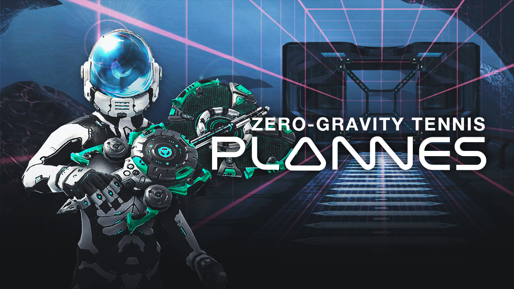
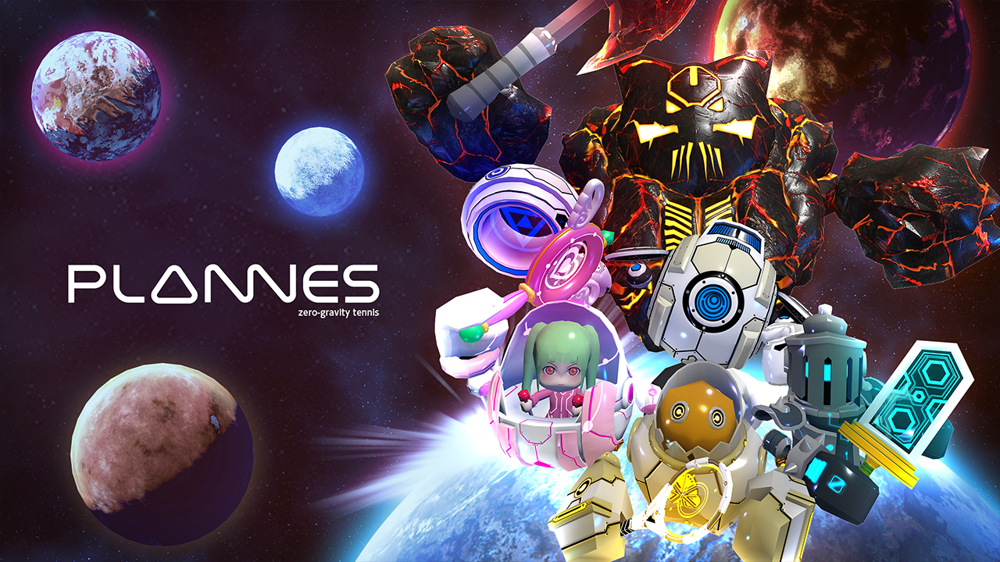
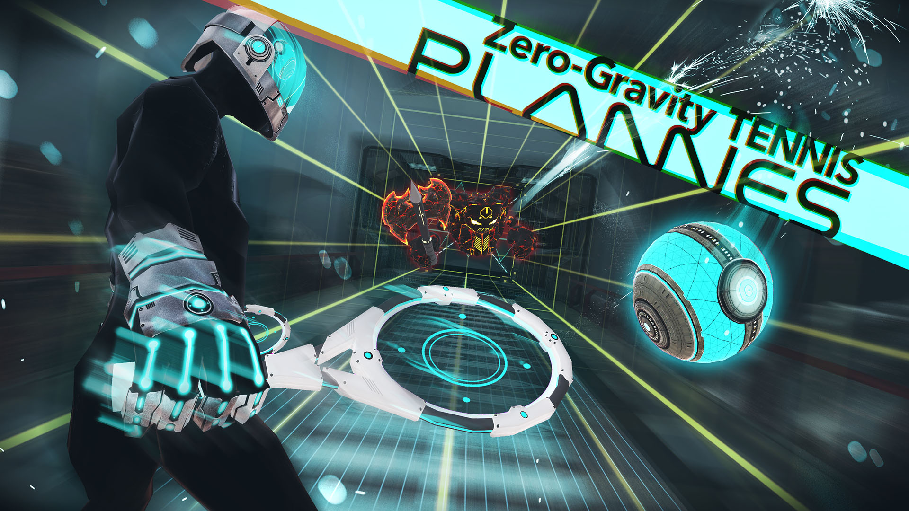

+++
date = "2016-10-21T16:20:52+09:00"
draft = false
tags = ["logo", "3D", "ui", "movie", "planning"]
title = "PLANNES"
share = false
image = "/develop/plannes/images/cover.jpg"
description = "VR Game for PC"
categories = ["develop"]
information = "true"
developmentPeriod = "1.5ヶ月"
member = "開発者1名 / デザイナー1名"
detail = ["体感ゲーム的な側面も強いVRで、軽い運動になるほどの体験を実現させるために無重力空間でのテニスを企画しました。50ステージほどのボリュームに加え、いろいろな特殊ラケットを解放してゆくことで、様々な必殺技を繰り出すことが可能な仕様になっています。","制作したアセットの量はそこまで多くはありませんが、その分をレベルデザインや演出制作の時間に充てており、「実際にラケットで球を打っているような錯覚がある」など、うれしいご意見もいただきました。"]

[[workDetail]]
  title = "キャラクター"
  [workDetail._target]
    text = "デザインからモデリング・テクスチャ制作、Humanoidセットアップ"
[[workDetail]]
  title = "背景・小道具"
  [workDetail._target]
    text = "デザインからモデリング・テクスチャ制作、Unity上でのシーンビルド、Prefab化"
[[workDetail]]
  title = "UI"
  [workDetail._target]
    text = "デザイン後、Unity上でレイアウトまで担当"
[[workDetail]]
  title = "その他ゲーム内作業"
  [workDetail._target]
    text = "企画・提案、キャラクターアニメーション、エフェクト、ゲーム内テキスト(日本語、英語)"
[[workDetail]]
  title = "ゲーム外制作物"
  [workDetail._target]
    text = "ロゴ、ストア画像アセット、プロモーション動画"

+++

### artwork / logo / character design

Cinema 4D, Adobe CC

制作期間 : 1週間

### level design

Unity, Cinema 4d, Adobe CC, Zbrush



制作期間 : 1ヶ月

### PV

Adobe CC, Cinema 4d



制作期間 : 2週間
