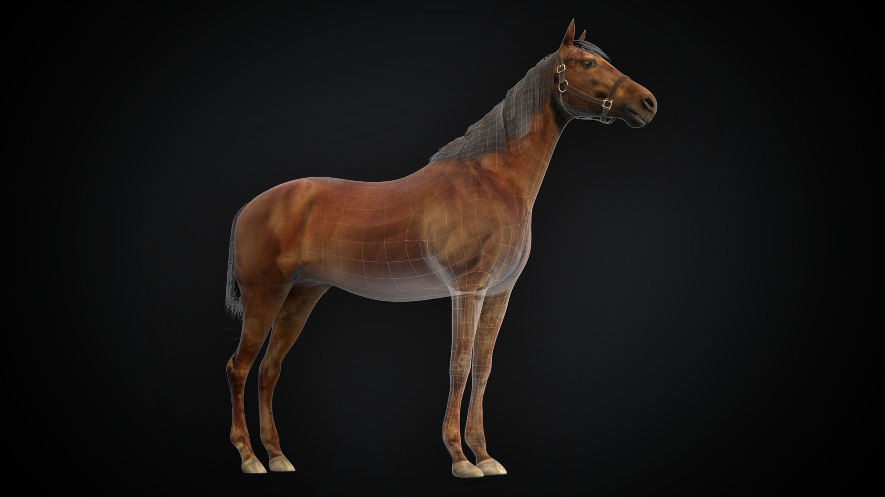
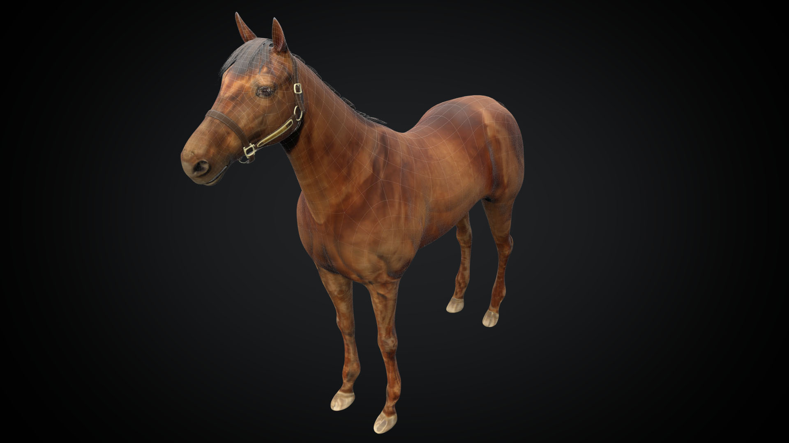

+++
date = 2019-12-02T20:19:37+09:00
draft = false
tags = ["3D"]
title = "Horse"
share = false
image = "/etude/horse/images/cover.jpg"
description = "3D Modeling"
categories = "etude"

+++

### modeling

Modo, Zbrush, Substance Painter, Unity

