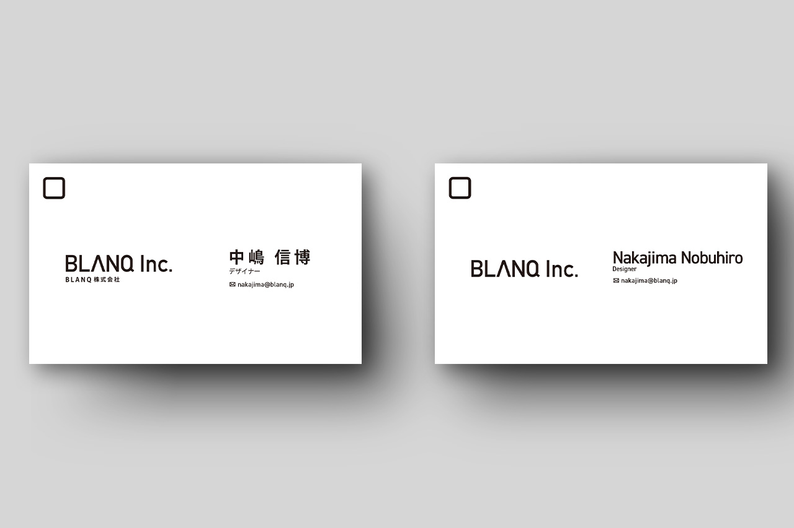

+++
date = "2016-02-21T16:20:52+09:00"
draft = false
tags = ["logo", "graphic"]
title = "BLANQ Inc"
share = false
image = "/misc/blanq/images/cover.jpg"
description = "Company"
categories = ["misc"]
information = "true"
developmentPeriod = "2週間"
member = "デザイナー1名"
workContent = ["ロゴ制作、名刺デザイン、印刷発注から納品まで"]

[[workDetail]]
  title = "ロゴ制作"
  [workDetail._target]
    text = "クライアント提出のイメージラフを元に打合せし、デザイン後、最終的なイメージまで決定"
[[workDetail]]
  title = "名刺デザイン"
  [workDetail._target]
    text = "印刷発注から納品まで"

+++

### Business Card

Illustrator

制作期間 : 1週間
