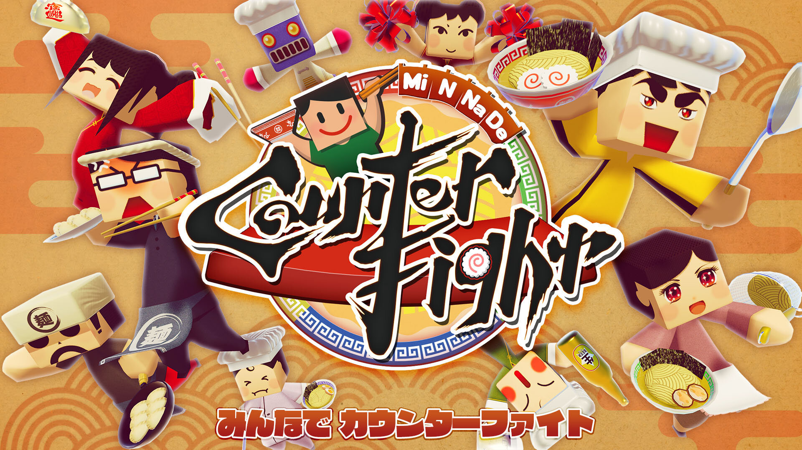
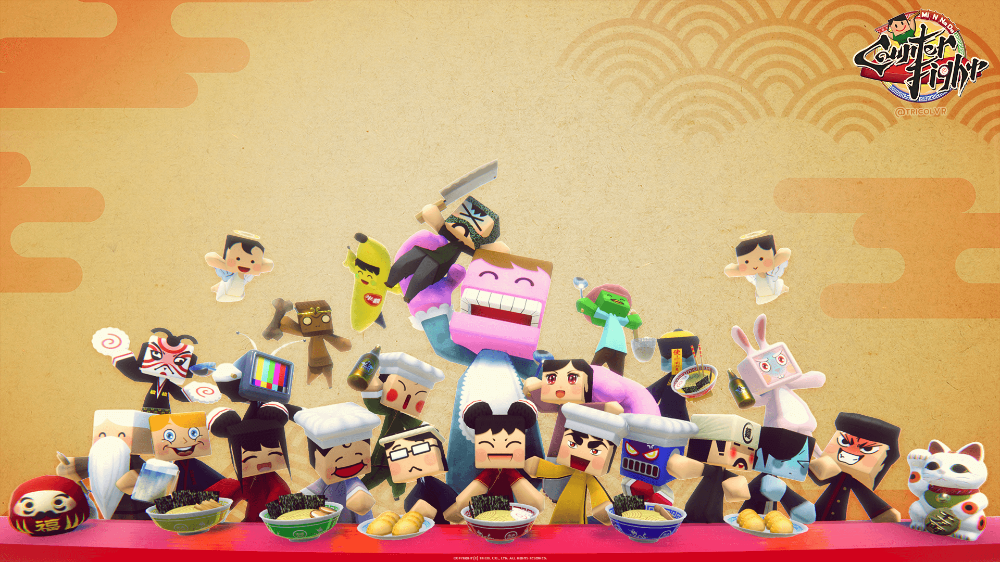

+++
date = 2020-05-02T20:34:13+09:00
draft = false
tags = ["logo", "3D", "ui", "movie", "planning"]
title = "MiNNaDe Counter Fight"
share = false
image = "/portfolio/mcf/images/cover.jpg"
description = "Game for PC & Nintendo Switch"
categories = ["portfolio"]

+++

### artwork / character design

Modo, Adobe CC

Production time : One week

### logo

Adobe CC



Production time : One week

### level design

Unity, Adobe CC, Substance Painter



Production time : Three month

### pv

Adobe CC, Unity



Production time : One week

### wallpaper

Adobe CC

### sns image

Adobe CC




