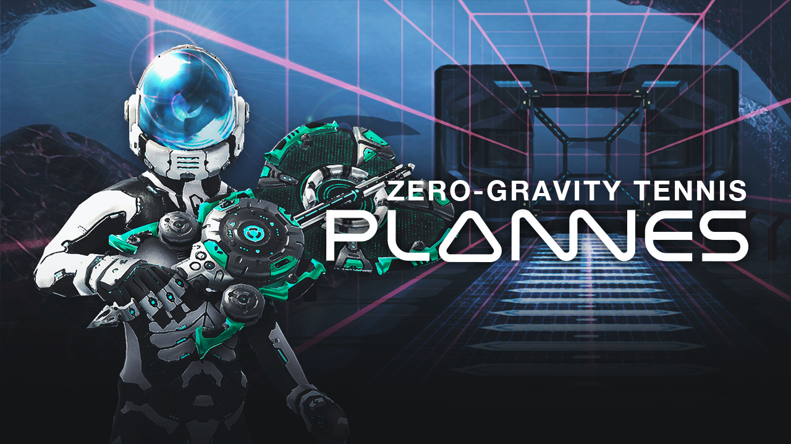
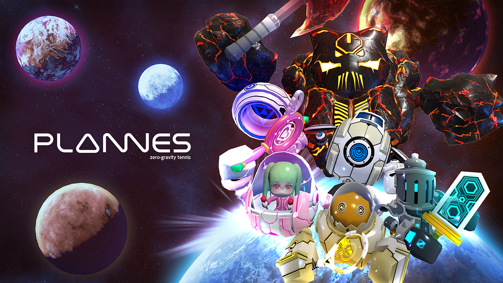
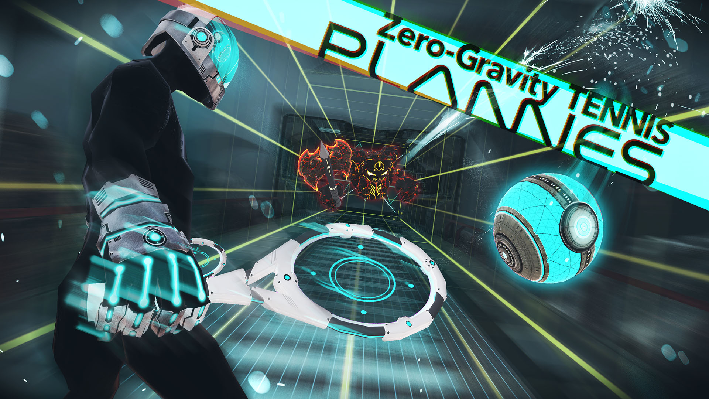

+++
date = "2016-10-21T16:20:52+09:00"
draft = false
tags = ["logo", "3D", "ui", "movie", "planning"]
title = "PLANNES"
share = false
image = "/portfolio/plannes/images/cover.jpg"
description = "VR Game for PC"
categories = ["portfolio"]

+++

### artwork / logo / character design

Cinema 4D, Adobe CC

Production time : One week

### level design

Unity, Cinema 4d, Adobe CC, Zbrush



Production time : One month

### pv

Adobe CC, Cinema 4d



Production time : Two weeks
