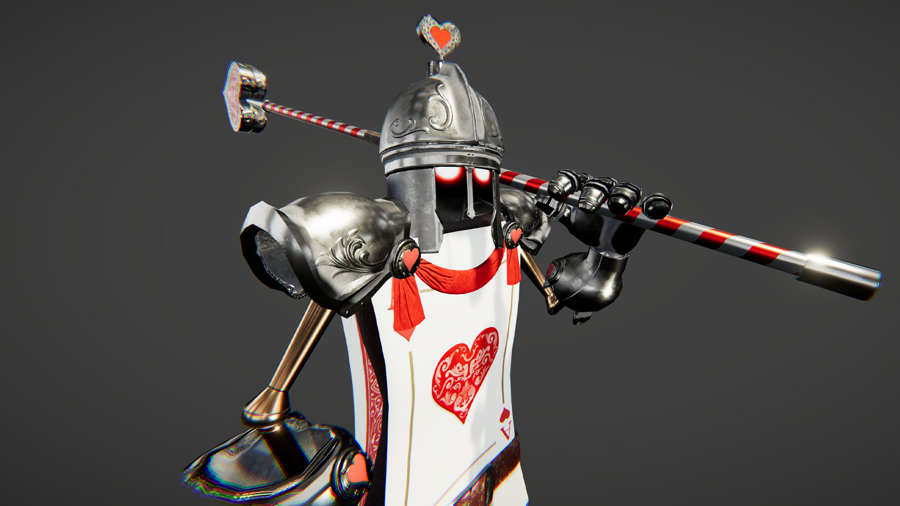
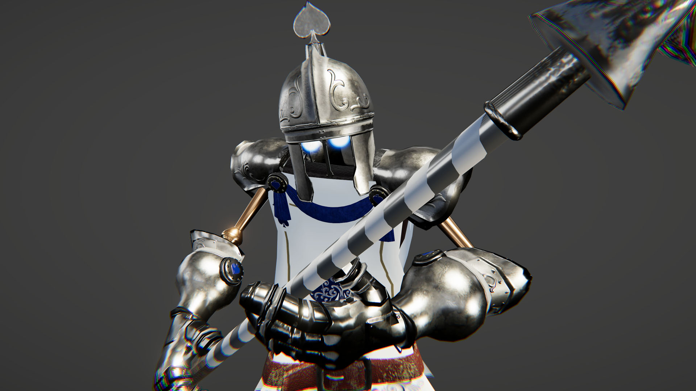
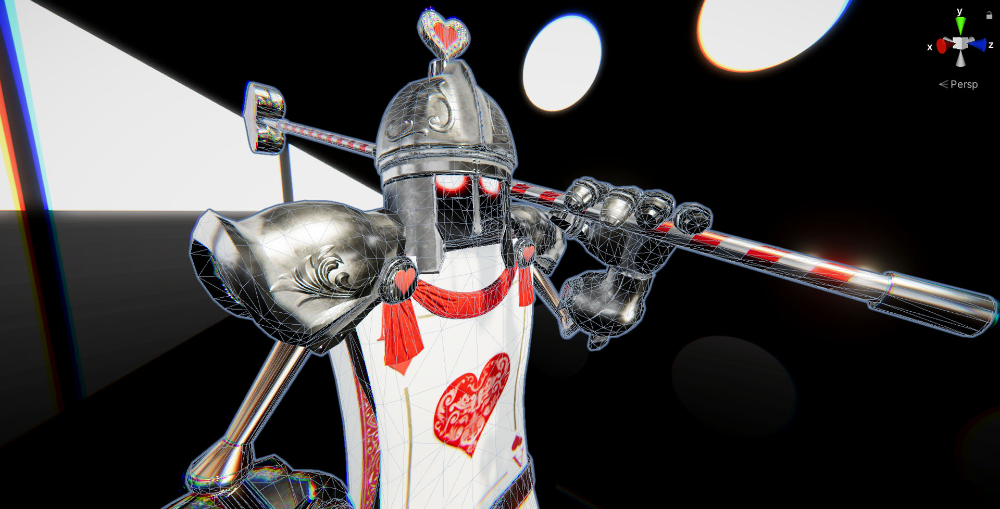
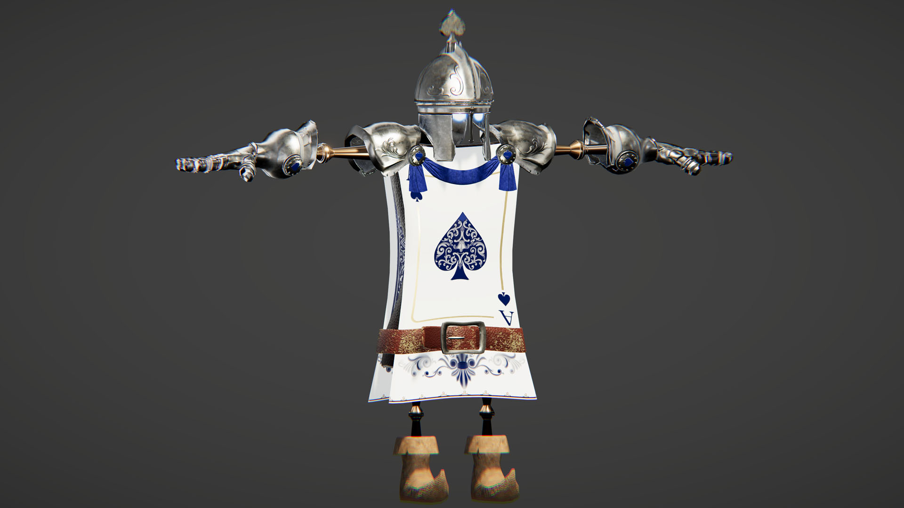

+++
date = 2019-09-24T20:19:37+09:00
draft = false
tags = ["3D"]
title = "Card Soldiers"
share = false
image = "/study/alice/images/cover.jpg"
description = "3D Modeling"
categories = "study"
information = "true"
detail = ["VR脱出ゲームのアセットとして制作したトランプ兵です。"]

[[workDetail]]
  title = "モデリング"
  [workDetail._target]
    text = "キャラクターデザインからスカルプト、Unityアセットへの容量削減まで"
[[workDetail]]
  title = "テクスチャ制作"
  [workDetail._target]
    text = "ハイポリモデルのベイク後、Substance Painterにて塗装"

+++

### character design

Modo, Substance Painter, Unity

### play movie


