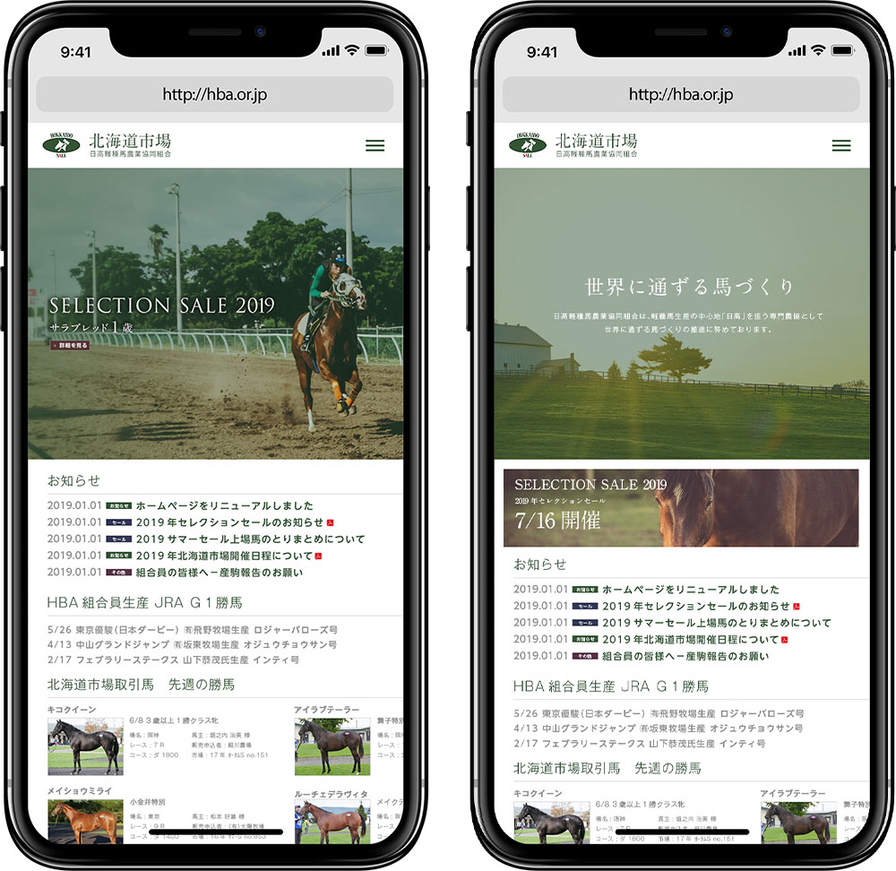

+++
date = 2019-07-25T20:19:37+09:00
draft = false
tags = ["web"]
title = "HBA"
share = false
image = "/study/hba/images/cover.jpg"
description = "Web Design"
categories = "study"
information = "true"
detail = ["北海道市場ホームページのリニューアルイメージ"]

[[workDetail]]
  title = "ラフ制作"
  [workDetail._target]
    text = "Photoshopにて制作したラフと、動作イメージの資料を制作して提出"

+++

### website

Adobe CC

