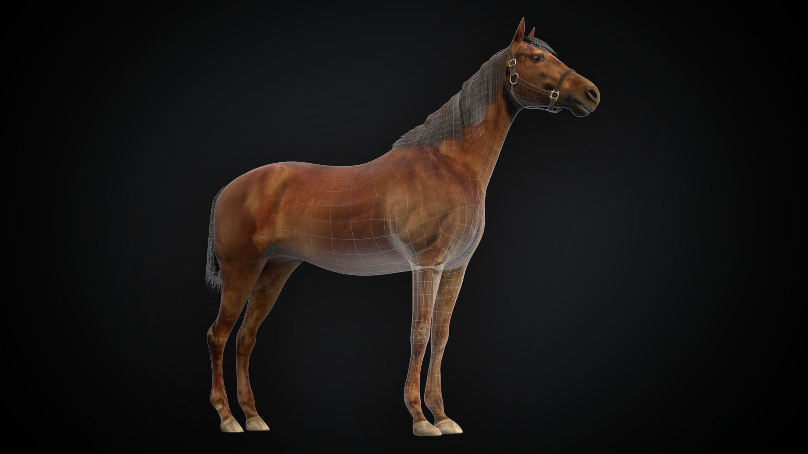
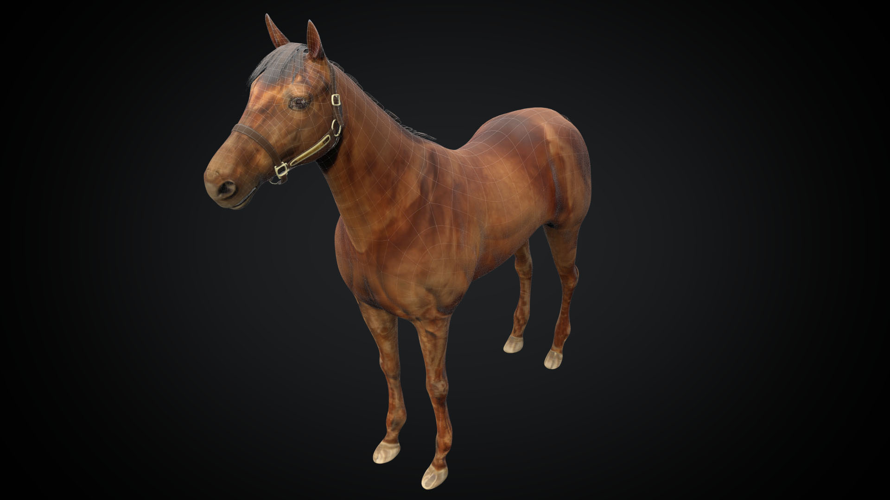

+++
date = 2019-12-02T20:19:37+09:00
draft = false
tags = ["3D"]
title = "Horse"
share = false
image = "/study/horse/images/cover.jpg"
description = "3D Modeling"
categories = "study"
information = "true"
detail = ["北海道にて実際にフォトグラメトリで撮影したものを元に、ZBrushでスカルプトし、最終的にゲームアセットまで容量削減させています。"]

[[workDetail]]
  title = "スカルプト"
  [workDetail._target]
    text = "写真や点群データを元に形状を成形"
[[workDetail]]
  title = "テクスチャ制作"
  [workDetail._target]
    text = "同じく写真をもとに制作"

+++

### modeling

Modo, Zbrush, Substance Painter, Unity

