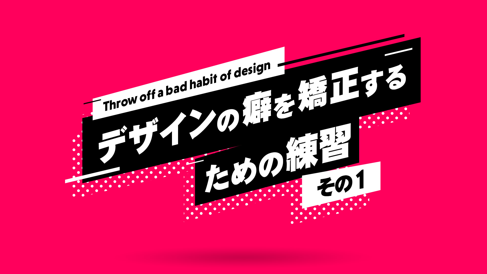
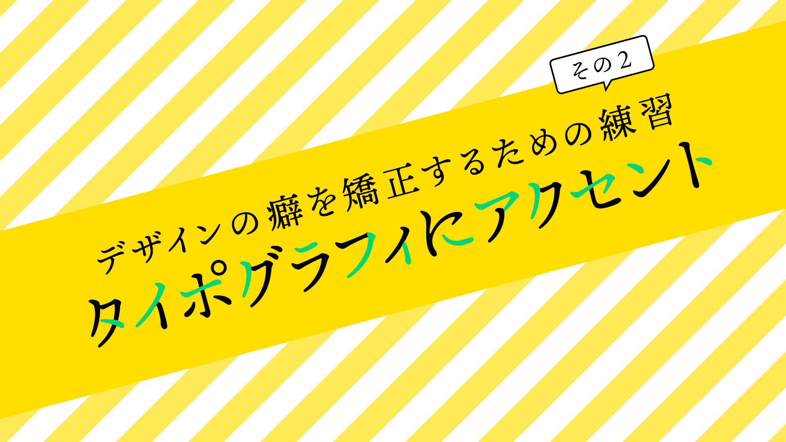
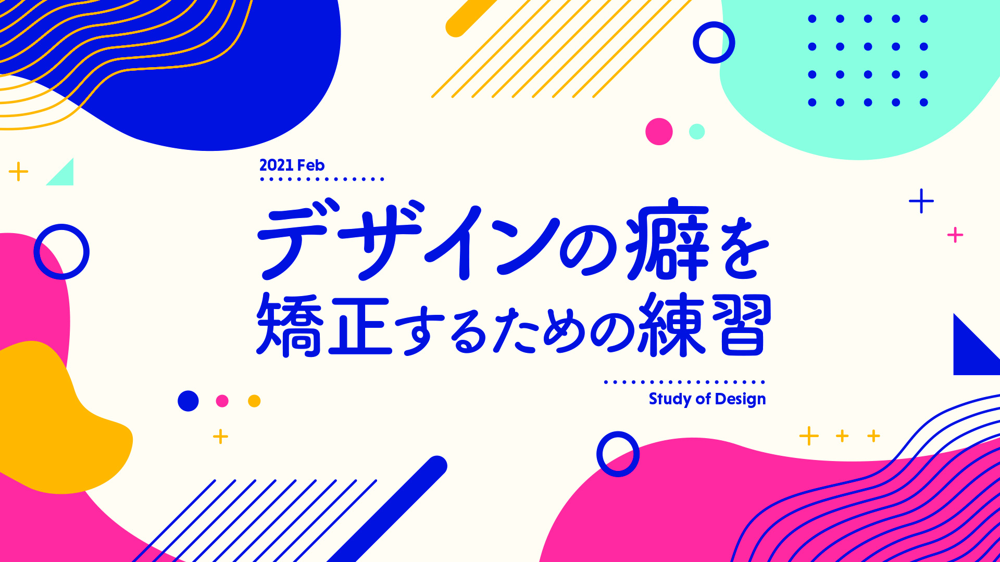
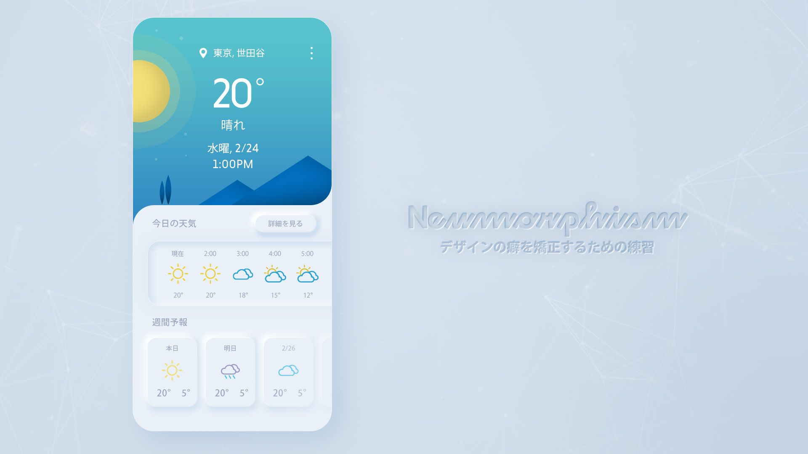
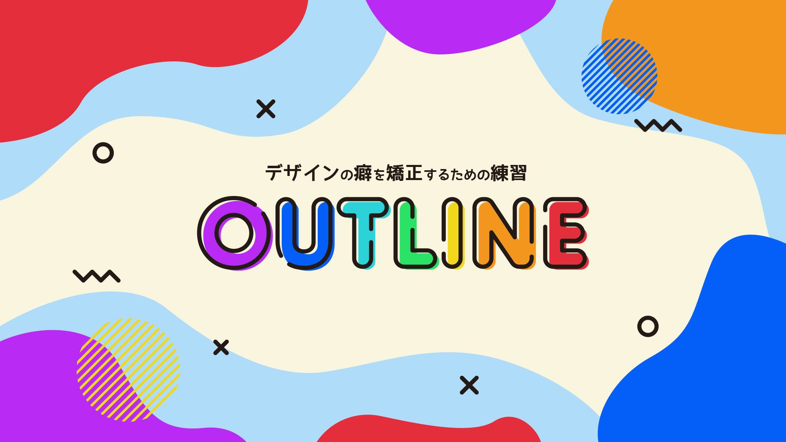

+++
date = 2021-02-23T20:19:37+09:00
draft = false
tags = ["study", "graphic", "ui"]
title = "Study of design 2021.2"
share = false
image = "/study/study202102/images/cover.jpg"
description = "Visually imitate"
categories = "study"
information = "true"
detail = ["年に一度、自習としてデザインの感覚を矯正する為の自主トレーニングをしており、制作物の一部になります。"]

[[workDetail]]
  title = "デザイン制作"
  [workDetail._target]
    text = "デザインをトレースせず、見本を見ながら作業して似たものを作る作業"

+++

### Fictitious thumbnail design

Adobe CC

