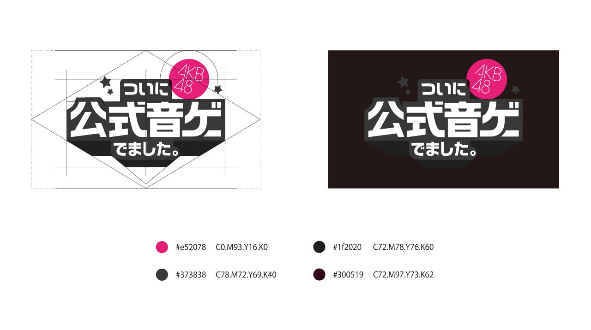

+++
date = "2014-02-21T16:20:52+09:00"
draft = false
tags = ["logo","ui","graphic"]
title = "AKB48 Official Rhythm Game"
description = "Android / iOS App"
share = false
image = "/ui/akb/images/cover.jpg"
categories = ["ui"]
information = "true"
developmentPeriod = "約3ヶ月"
member = "デザイナー2名"
detail = ["AKB48の公式リズムゲームです。","立ち上げからゲーム運営まで従事しました。","運営中は業務効率の改善として、Photoshopスクリプトによる画像量産の効率化などもおこないました。"]

[[workDetail]]
  title = "UI"
  [workDetail._target]
    text = "パターン出し、Photoshopによるデザインまでで、実装は外注"
[[workDetail]]
  title = "ロゴ"
  [workDetail._target]
    text = "タイトル決定から企画に参加、パターン出しから最終フィニッシュまで"
[[workDetail]]
  title = "印刷物"
  [workDetail._target]
    text = "ディレクター指示のもとデザイン制作まで"

+++

### UI

Adobe CC



### logo

Illustrator

### poster

Illustrator, Photoshop



### flyer

Illustrator, Photoshop


