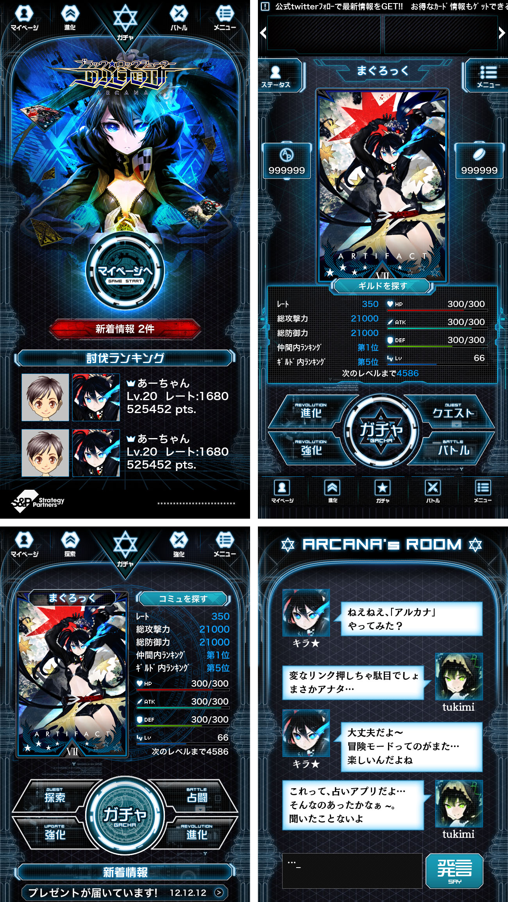
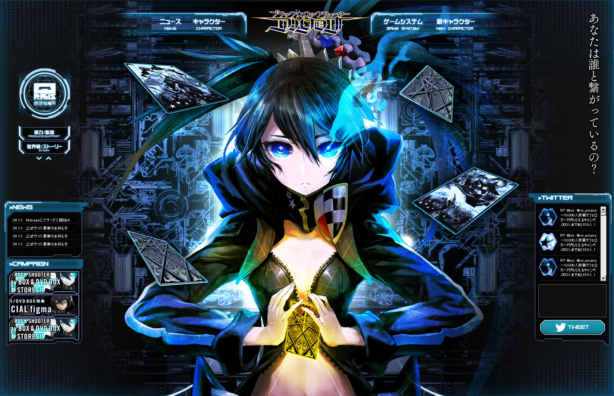
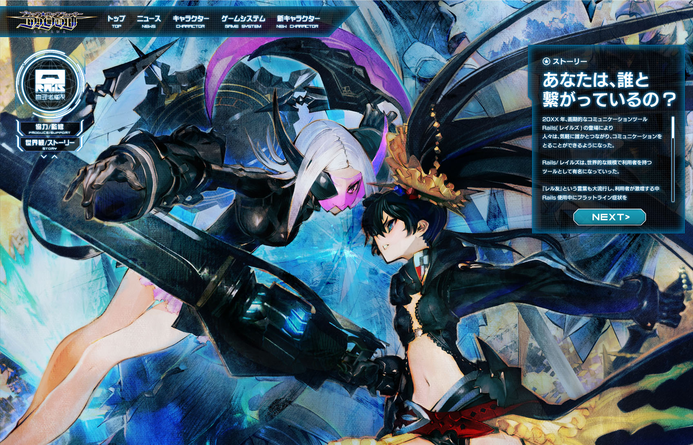

+++
date = "2012-02-21T16:20:52+09:00"
draft = false
tags = ["web", "ui"]
title = "Black Rock Shooter ARCANA"
description = "Mobile Game 2012"
share = false
image = "/ui/brs/images/cover.jpg"
categories = ["ui"]
information = "true"
developmentPeriod = "約3ヶ月"
member = "デザイナー1名"
detail = ["仮想のOSを操作する設定のゲームであることを前提に制作しました。","モバイルゲームのUI配置がベースとして定義されているため、大きな改変はできませんが、アイコンやボタン等の作りこみで世界観を伝えられるよう設計しています。"]

[[workDetail]]
  title = "UI"
  [workDetail._target]
    text = "パターン出し、Photoshopによるデザインまで"
[[workDetail]]
  title = "Web制作"
  [workDetail._target]
    text = "デザイン、コーディング"

+++

### UI

Photoshop

### website

Photoshop, jQuery, Tween.js

