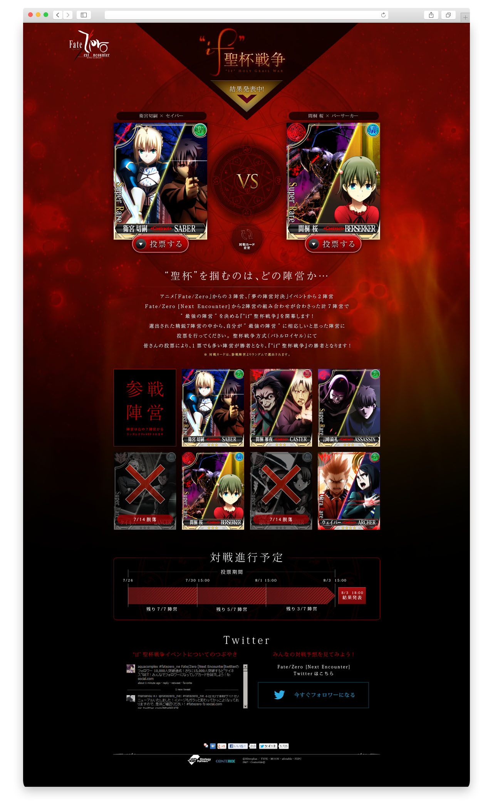

+++
date = "2013-02-21T16:20:52+09:00"
tags = ["web"]
title = "Fate Zero Next Encounter"
description = "Mobile game 2013"
share = false
image = "/ui/fz/images/cover.jpg"
categories = ["ui"]
information = "true"
developmentPeriod = "約2ヶ月"
member = "デザイナー1名"
detail = ["Fate ZeroのモバイルゲームUIです。","原作にあるマスター、サーヴァントの組み合わせを自由に変化させられることがセールスポイントであったため、公式サイトでもTOPの組み合わせがランダムに変化するよう制作しました。","限界まで品質にこだわり続ける版権元の監修は非常に厳格で、参考になるご意見をたくさんいただきました。"]

[[workDetail]]
  title = "UI"
  [workDetail._target]
    text = "パターン出し、Photoshopによるデザインまで"
[[workDetail]]
  title = "Web制作"
  [workDetail._target]
    text = "デザイン、コーディング"

+++

### ui

Photoshop

### website

jQuery, Photoshop, Illustrator

### Campaign Site

jQuery, Photoshop

