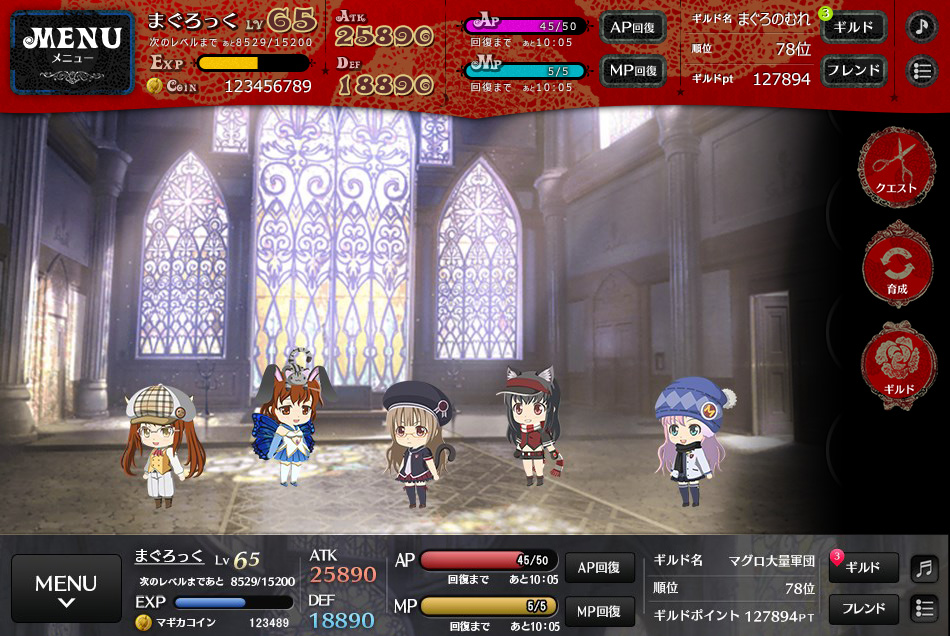
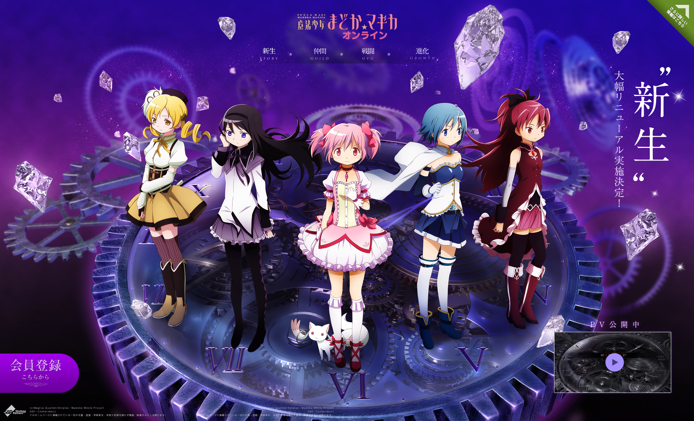
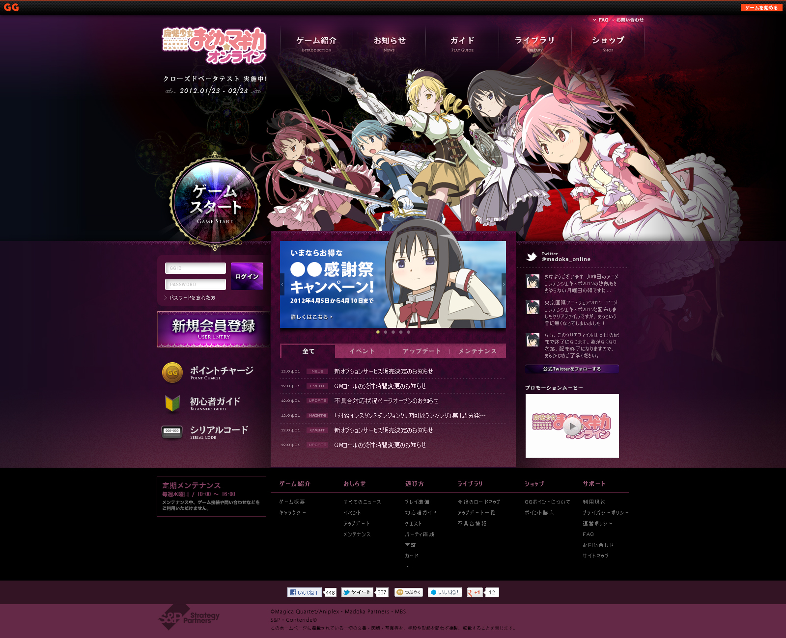
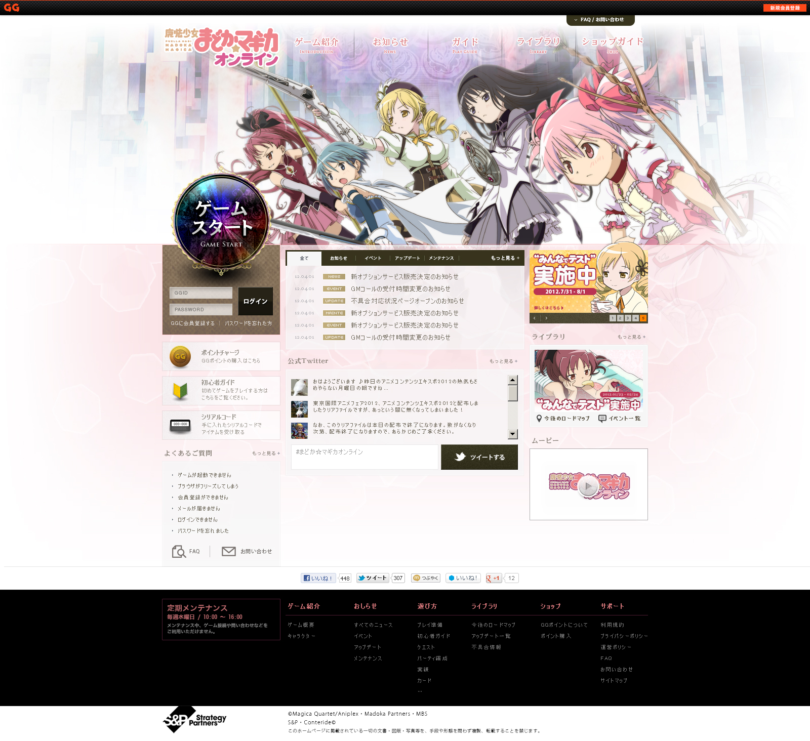

+++
date = "2012-08-27T16:20:52+09:00"
draft = false
tags = ["web", "ui"]
title = "Puella Magi Madoka Magica Online"
description = "Mobile Game 2012"
share = false
image = "/ui/mm/images/cover.jpg"
categories = ["ui"]
information = "true"
developmentPeriod = "約3ヶ月"
member = "デザイナー1名"
detail = ["UIは劇団イヌカレー様のテイストを参考に、公式のフォントやマテリアルを使用して制作しています。"]

[[workDetail]]
  title = "UI"
  [workDetail._target]
    text = "パターン出し、Photoshopによるデザインまで"
[[workDetail]]
  title = "Web制作"
  [workDetail._target]
    text = "デザイン、コーディング"

+++

### UI

Photoshop

### website

Photoshop, jQuery, Tween.js

