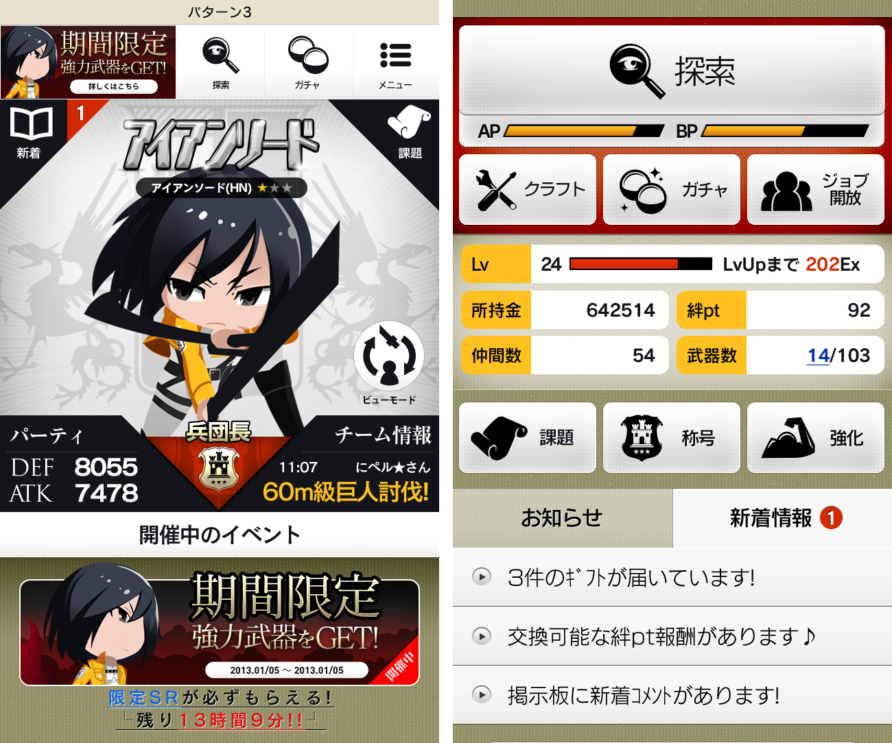
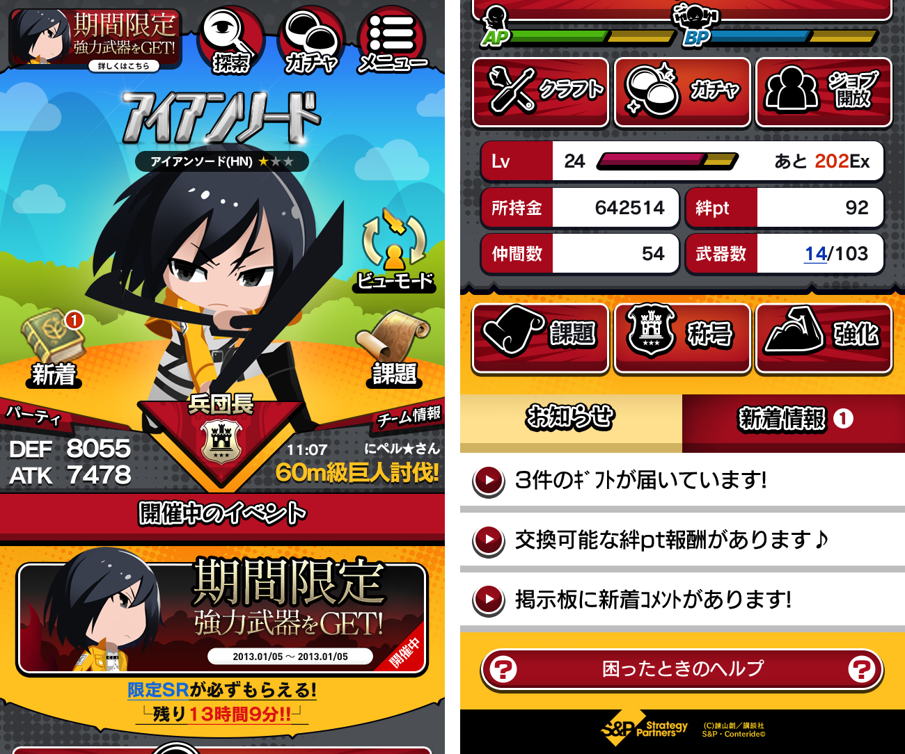

+++
date = "2013-12-24T16:20:52+09:00"
draft = false
tags = ["web", "ui"]
title = "Attack on Titan Online"
description = "Mobile Game 2012"
share = false
image = "/ui/sk/images/cover.jpg"
categories = ["ui"]
information = "true"
developmentPeriod = "約3ヶ月"
member = "デザイナー1名"
detail = ["シンプルなゲーム構成ですが原作漫画にはない独自の設定・仕様が多く実装されていたため、UIのテイストも公式にとらわれず提案しました。"]

[[workDetail]]
  title = "UI"
  [workDetail._target]
    text = "パターン出し、Photoshopによるデザインまで"

+++

### UI

Photoshop

