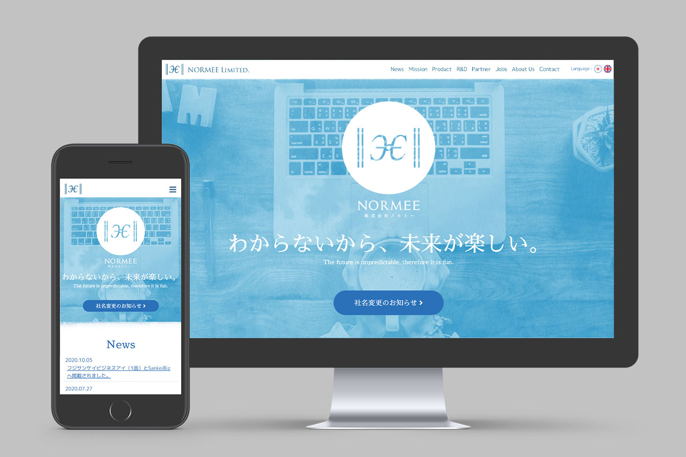

+++
date = "2018-09-03T16:20:52+09:00"
draft = false
tags = ["logo", "graphic", "web"]
title = "NORMEE Limited."
share = false
image = "/web/normee/images/cover.jpg"
description = "System Development Corporation"
categories = ["web"]
information = "true"
developmentPeriod = "1.5ヶ月"
member = "デザイナー1名"
detail = ["ロゴデザインに半月、残りの期間で名刺とWebの制作を対応しました。","社名に込められた意味に着目し、数学のノルム記号(数学用語NORMから着想)の中に、ギリシャ文字「E（イプシロン)」をふたつ配置したロゴにしました。ギリシャ文字を起原とするグラゴール文字の合字にならい、EとEを小さい円で結んでいます。"]

[[workDetail]]
  title = "ロゴ"
  [workDetail._target]
    text = "パターン出し、デザイン、レギュレーション資料制作"
[[workDetail]]
  title = "Webサイト"
  [workDetail._target]
    text = "デザイン、コーディング"
[[workDetail]]
  title = "名刺"
  [workDetail._target]
    text = "提案と入稿データ制作"

+++

### website

jQuery, Photoshop

制作期間 : 1週間

### card

illustrator

制作期間 : 1週間

### logo

Photoshop, Illustrator



制作期間 : 1ヶ月
