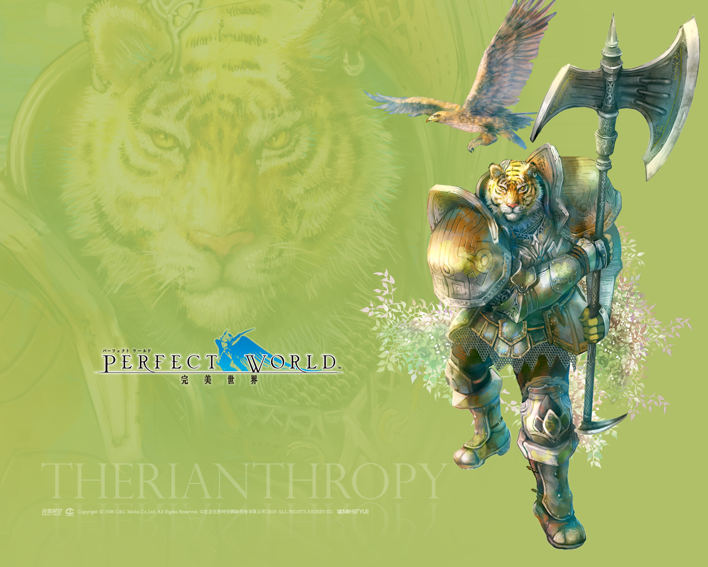

+++
date = "2007-04-09T16:20:52+09:00"
draft = false
tags = ["logo", "web", "artDirection"]
title = "Perfect World"
share = false
image = "/web/pw/images/cover.jpg"
description = "MMORPG from China"
categories = ["web"]
information = "true"
developmentPeriod = "約1ヶ月"
member = "デザイナー1名"
detail = ["中国で開発されたMMORPGで、日本語版のビジュアルの全面改修に関わりました。","ブランドサイトの制作を並行して進めつつ、イラストレーターとのやり取りを重ねて制作しています。"]

[[workDetail]]
  title = "ディレクション"
  [workDetail._target]
    text = "メインビジュアルとなるイラストの発注、クオリティ管理"

+++

### art direction

Photoshop, Illustrator



### artwork

Photoshop, Illustrator
(Illustration is outsourced.)

