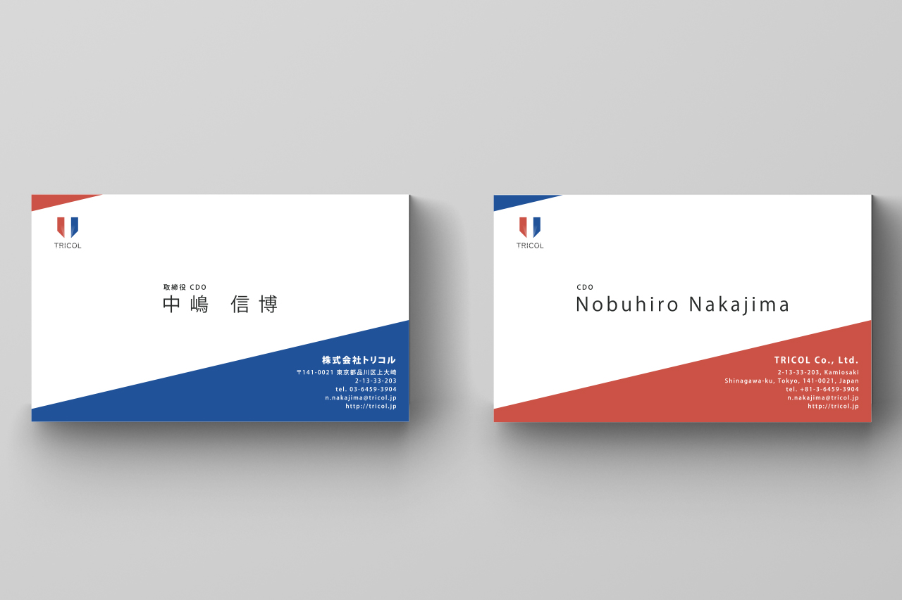

+++
date = "2016-02-21T16:20:52+09:00"
draft = false
tags = ["logo", "graphic", "web"]
title = "Tricol Co., Ltd."
share = false
image = "/web/tricol/images/cover.jpg"
description = "VR Development Company"
categories = ["web"]
information = "true"
developmentPeriod = "1ヶ月"
member = "デザイナー1名"
workContent = ["ロゴデザイン、名刺デザイン、リーフレットのデザイン","Webサイトデザイン、コーディング"]
detail = ["起業にあたり制作したロゴデザインです。三色のトリコロールカラーは、3人での起業した経緯を表しています。","Webサイトは当初Hugoで構築・運用していましたが、更新頻度の上昇に伴い管理を引き継ぐ必要が出てきたため、最終的にSquarespaceへ移行し、同時にリニューアルを担当しました。"]

[[workDetail]]
  title = "ロゴ"
  [workDetail._target]
    text = "パターン出しから最終デザインまで"
[[workDetail]]
  title = "名刺"
  [workDetail._target]
    text = "デザインから印刷会社、用紙選定、納品まで"
[[workDetail]]
  title = "リーフレット"
  [workDetail._target]
    text = "デザインから印刷会社、用紙選定、納品まで"
[[workDetail]]
  title = "Webサイト"
  [workDetail._target]
    text = "企画・提案、デザイン、コーディング"

+++

### logo

illustrator

制作期間 : 1週間

### CI

illustrator

制作期間 : 1週間

### website

Photoshop, Illustrator,
build at [SQUARESPACE](https://www.squarespace.com/)

制作期間 : 2週間
